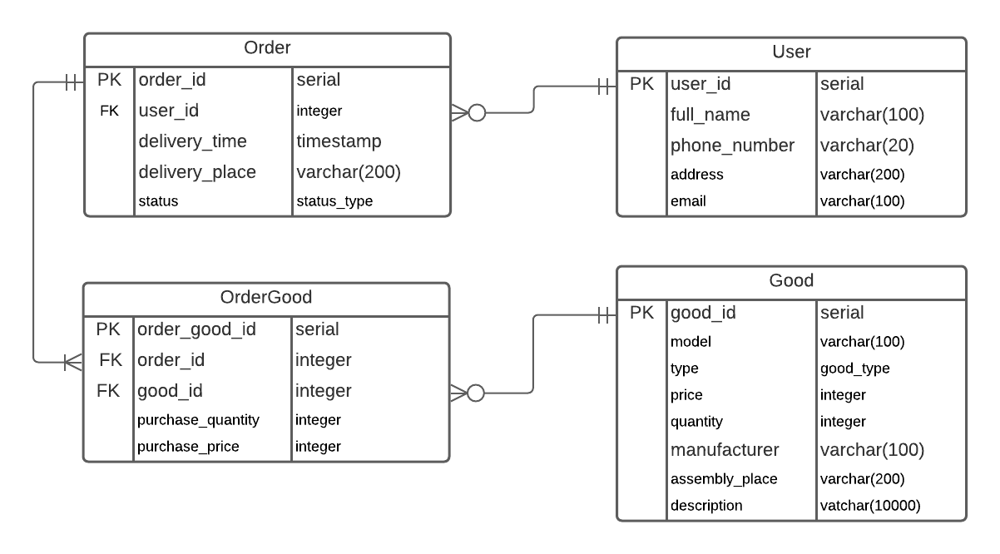

# Практикум по веб-технологиям
Вариант: Интернет-магазин бытовой техники.

## Схема базы данных

status_type - пользовательский тип перечисления строк 'в обработке', 'собран', 'в пути', 'доставлен'.

good_type   - пользвательский тип перечисления строк 'телевизор', 'DVD-проигрыватель', 'холодильник', 'стиральные машины' и тому подобное.

purchase_price - цена товара на момент покупки. 

purchase_quantity - количество определённого товара, которое было куплено в заказе. 

## Описание страниц

На каждой странице сущствует навигационная панель с ссылками на Main, Users, Goods, Orders.

### Главная страница (Main)

* Ссылка на страницу всех пользователей
* Ссылка на страницу всех товаров
* Ссылка на страницу всех заказов

### Пользователи (Users)

* Кнопка для создания нового пользователя: перенаправляет на страницу Изменения пользователя ('User editing')
* Список всех пользователей. Каждый пользователь в списке пользователей имеет ссылку на страницу с 
информацией об этом пользователе ('User information')
* В списке пользователей на данной странице находятся ФИО, телефонный номер и электронная почта пользователя

### Информация о пользователе (User information)

* Атрибуты конкретного пользователя: id, ФИО, номер телефона, адрес, электронный адрес
* Кнопка изменения текущего пользователя: перенаправляет на страницу Изменения пользователя ('User editing')
* Кнопка удаления пользователя: удаляет пользователя информация о котором на странице и перенаправляет на страницу всех пользователи ('Users')

### Изменение пользователя (User editing)

* Атрибуты пользователя, которые можно изменить (или заполнить в случаи создания нового). Изменение/создания
происходит после нажатия кнопки 'save'. Изменять можно: ФИО, телефон, адрес, электронный адрес
* Кнопка 'save': изменяет информацию о пользователе и перенаправляет на страницу с информацией о нём ('User information')
* Кнопка 'cancel': отменяет изменение и перенаправляет на страницу всех пользователей ('Users')

### Товары (Goods)

* Кнопка для создания нового товара: перенаправляет на страницу Изменения товара ('Good editing')
* Список всех товаров. Каждый товар в списке имеет ссылку на страницу с 
информацией об этом товаре ('Good information')
* В списке товаров на данной странице находятся: тип, модель, произовдитель, цена, количество на складе
* Панель для поиска товара по типу, производителю, характеристикам

### Информация о товаре (Good information)

* Атрибуты конкретного товара: тип, модель, цена, количество на складе, производитель, место сборки, характеристики (описания товара)
* Кнопка изменения текущего товара: перенаправляет на страницу Изменения товара ('Good editing')
* Кнопка удаления товара: удаляет товар информация о котором на странице и перенаправляет на страницу всех товаров ('Goods')

### Изменение товара (Good editing)

* Атрибуты товара, которые можно изменить (или заполнить в случаи создания нового). Изменение/создания
происходит после нажатия кнопки 'save'. Изменять можно: тип, модель, цену, количество на складе, производителя, место сборки, характеристику
* Кнопка 'save': изменяет информацию о товаре и перенаправляет на страницу с информацией о нём ('Good information')
* Кнопка 'cancel': отменяет изменение и перенаправляет на страницу всех товаров ('Goods')

### Заказы (Orders)

* Кнопка для создания нового заказа: перенаправит на страницу Создания заказа ('Order creation').
* Список всех заказов. Каждый заказ в списке имеет ссылку на страницу с 
информацией об этом заказе ('Order information')
* В списке заказов на данной странице находятся: id, имя покупателя, время доставки, адрес доставки, статус

### Информация о заказе (Order information)

* Информация о заказе: id заказа, заказчик, множество товаров, их количество и цена, суммарная стоимость, 
статус заказа, место доставки, время доставки
* Кнопка удаления заказа: удаляет заказ, информация о котором на странице и перенаправляет на страницу всех заказов ('Orders')

### Создание нового заказа (Order creation)
* На странице находится список всех товров. Указывается количество каждого для покупки. Если товар не покупается количество равно 0.
* Кнопка 'save': создаёт заказ и перенаправляет на страницу с информацией о нём ('Order information')
* Кнопка 'cancel': отменяет создание и перенаправляет на страницу всех заказов ('Order')

## Сценарии использования

### Добавление нового пользователя
1. Main->Users
2. Нажать на 'create user' (Users->User editing)
3. Ввести данные
4. Нажать save (User editing->User information)

Для товаров аналогично.
### Изменение данных пользователя
1. Main->Users
2. Найти пользователя в списке и перейти по его ссылке (Users->User information)
3. Нажать на Edit user (User information -> User editing)
4. Изменить данные. Старые данные уже будут в нужных полях.
5. Нажать save (User editing -> User information)

Для товаров аналогично.
### Удаление пользователя
1. Main->Users
2. Найти пользователя в списке и перейти по его ссылке (Users->User information)
3. Нажать на delete this user (User information -> Users)

Для товаров аналогично.
### Получение информации о количество товара на складе
1. Main->Goods
2. Найти нужный товар в списке и перейти по ссылке (Goods->Good information)
3. На странице находится информация о количестве товара на складе
### Получение списка товаров определённого производителя 
1. Main->Goods
2. Воспользоваться панелью поиска. Будет выведен список товаров искомого производителя
### Оформление заказа
1. Main->Orders
2. Нажать на create order (Orders->Order creation)
3. Вводить количество нужного товара для покупки, ввести индефикатор покупателя, ввести данные о месте и времени доставки и нажить add new good
4. Нажать save (Order creation->Order information)
### Просмотр купленных в заказе товаров
1. Main->Orders
2. Найти нужный заказ в списке перейти по его ссылке(Orders->Order information)
3. На странице находится нужная информация
### Просмотр заказов определённого пользователя
1. Main->Orders
2. Воспользоваться панелью поиска по идентификатору пользователя
3. Будут выведены все заказы данного пользователя
### Проверка статуса заказа
1. Main->Orders
2. Найти нужный заказ в списке перейти по его ссылке(Orders->Order information)
3. На странице находится нужная информация
